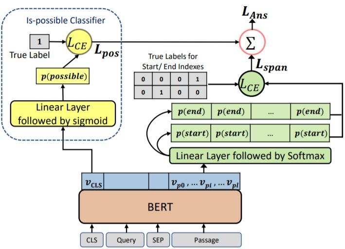

# Machine Reading Comprehension on NAVER-KorQuAD dataset
This repo is for implementation of team 7 (ELSA)'s method for solving QA task on NAVER-KorQuAD dataset.   
We point out the approaches:
+ Use of pretrained KoElectra ([repo](https://github.com/monologg/KoELECTRA))
+ New criteria for answer aggregation using additional verifier
+ Extension of training datatset

## Customized KoElectra for Question and Answering
Since class  _ElectraForQuestionAnswering_ does not supported for given environment, we have defined customized class.   
It includes additional verifier as its components.

    class ElectraForQuestionAnswering(ElectraPreTrainedModel):
      def __init__(self, config):
          super(ElectraForQuestionAnswering, self).__init__(config)
          self.num_labels = config.num_labels

          self.electra = ElectraModel(config)
          self.qa_outputs = nn.Linear(config.hidden_size, config.num_labels)
          self.ifv = nn.Linear(config.hidden_size, 2)
          self.softmax = nn.Softmax(dim=1)
          self.init_weights()
      ...
The architecture of model is similar to this figure.

## Appliance of Criteria
Definition of criteria can be found in open_squad_metrics.py.

    def compute_predictions_logits(
        ...
    ):
    ...
        # Define criteria for answer aggregation
        for (i, entry) in enumerate(nbest):
            ...
            output["probability"] = probs[i] - probs[null_index] + 2 * ans_prob - 1
            ...
 
    def select_best_predictions(all_nbest_json, null_ths=0.4, is_test=True):
      ...
      for qid in best_answer_max_prob.keys():
          ...
          if prob <= 0.1:
              ans = ""
          ...
 
## Result
Main result comparing candidates for answer aggregation criterias   
   

Influence of extended dataset    
   

Best Record in LeaderBoard
+score (test-f1): 0.7158 (1st place)
+session-checkpoint: kaist007/korquad-open-ldbd3/417-electra_best

## Running
It is recommended to use run_nsml.sh for execution. 
Theses are important arguments for experiments:
+ load_cache / cached_session~: use cached dataset in specified session, it reduces execution time
+ do_~: determines whether pretrain (span-style/qa-style), train, validation is conducted, it enables modularized experiment
+ mix_qa: shuffle and reconstruct question/answer pairs in pretraining dataset

The following is an example for conducting a complete experiment using Span-Style pretraining without mixing.

    nsml run \
    -m "complete example experiment" \
    -d korquad-open-ldbd3 \
    -g 2 \
    -c 1 \
    -e run_squad.py \
    -a "--model_type electra
      --model_name_or_path bert-base-multilingual-cased
      --do_initial_validation
      --do_pretrain_span
      --do_train
      --do_eval
      --data_dir train
      --num_train_epochs 2
      --per_gpu_train_batch_size 24
      --per_gpu_eval_batch_size 24 
      --output_dir output
      --verbose_logging
      --overwrite_output_dir
      --version_2_with_negative"

## Contributors
__Minyeong Hwang__, __Junseok Choi__, __Junghyun Lee__
